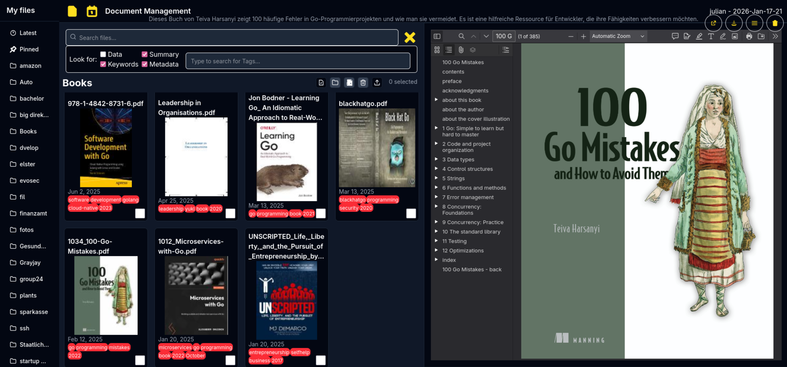

# FileClap: Clear the paperwork off the table
Your digital assistant for students and trainees

No more paper chaos! FileClap helps you easily organize photos, receipts, and important documents. Securely stored and accessible from anywhere—for a stress-free daily life with more clarity!

Uses Vector embeddings to aid in context aware searching

<a href="fileclap.com/home"><h1>check it out!</h1></a>
